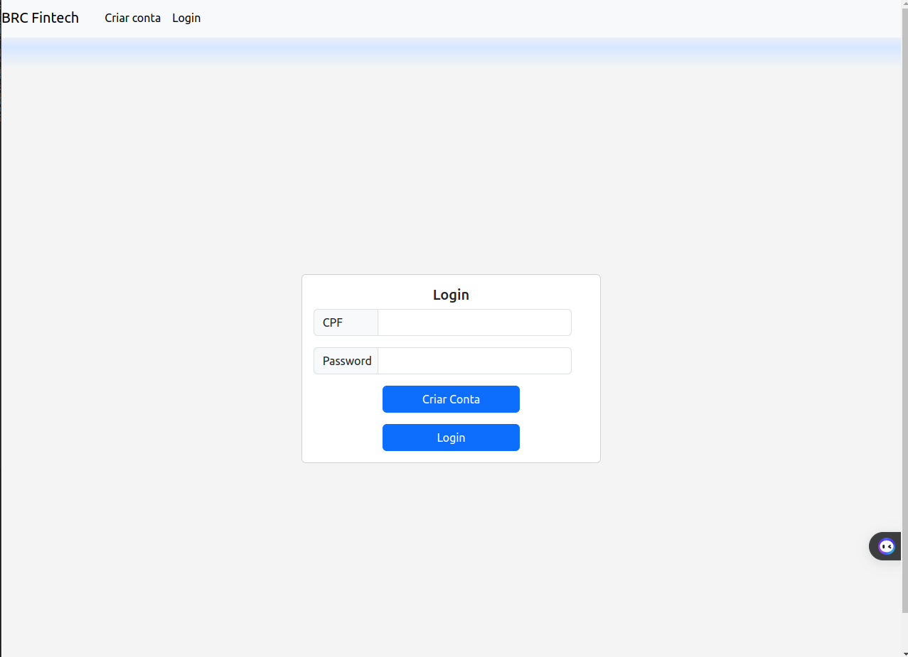
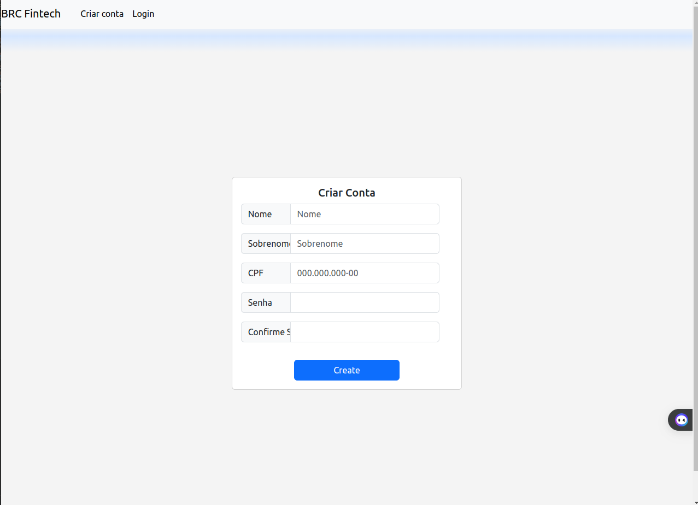
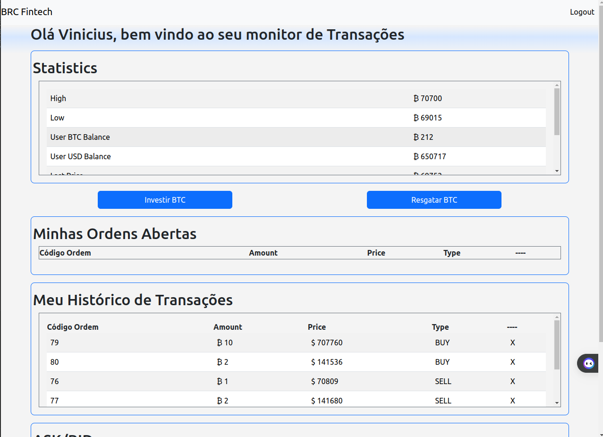
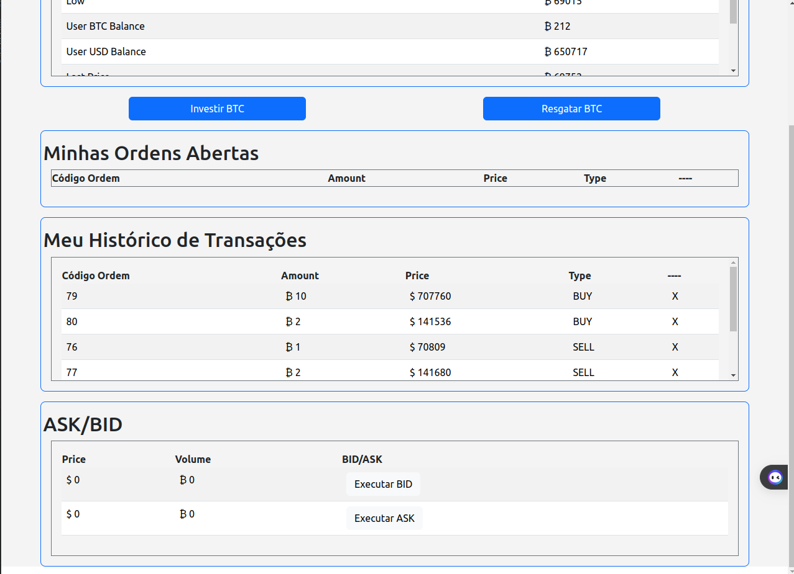
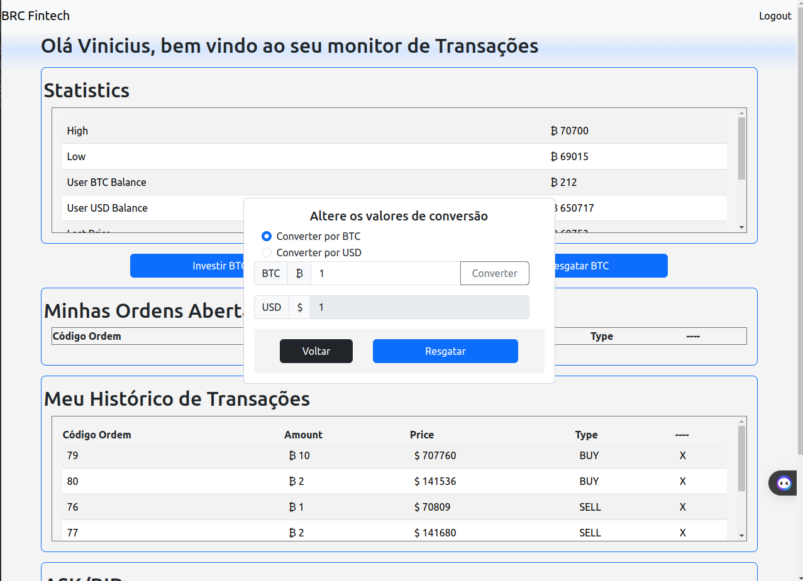
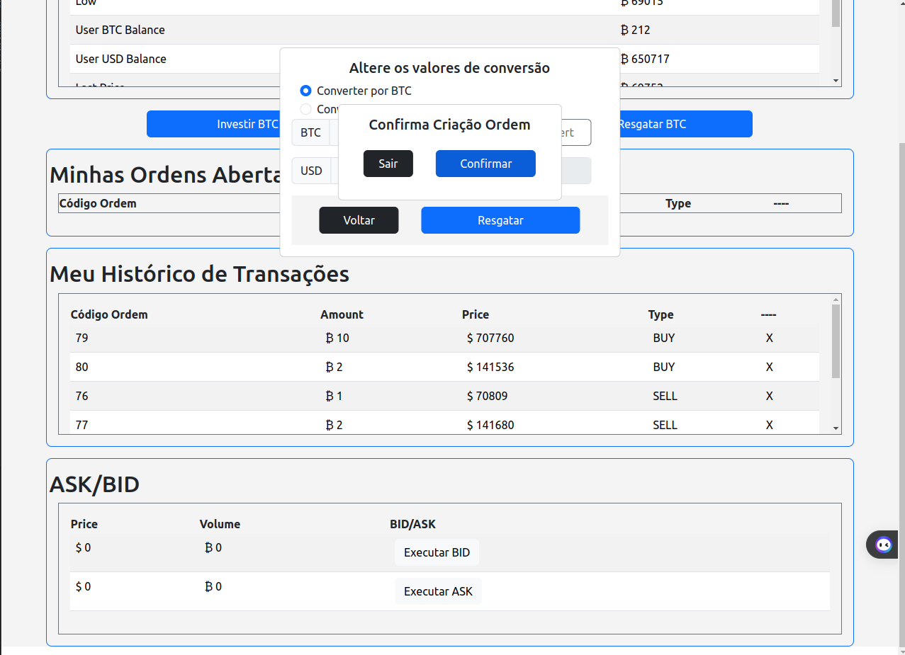

# PROJETO BRC
* Backend NodeJS
* Frontend ReactJS
* Banco de Dados PostgreSQL

## Configurando o banco de dados 
* ### 1 - No diretório backend, haverá um arquivo .env.sample
* ### 2 - Copie-o e renomeie-o para .env

```
HOST=yourhost
DIALECT=yourdialect
USERNAME=yourusername
PASSWORD=yourpassword
PORT=yourport
DATABASE=yourdatabase
SECRET=brc_test
```
* ### 3 - substitua pelas informações relativas a sua conexão

* Nesse projeto está sendo utilizado o banco de dados postgreSQL, mas o Sequelize permite outras bases de dados.
> Pode baixa-lo ou usar por container, fica a seu critério
* ### 4 - Uma vez sua base de dados executando e rodando, execute o seguinte comando.
```
npx sequelize-cli db:create
```
* Caso não consiga criar o database, pode haver problemas de permissão, nesse caso execute os comandos 

```
ALTER USER seu_usuario WITH SUPERUSER;
```
* reinicie seu banco de dados (instruções para usuários Linux, para Windows podem haver pequenas diferenças)
```
sudo systemctl restart postgresql
```
* ### 5 - execute o comando para a migrations serem executadas e as tabelas serem criadas.
```
npx sequelize-cli db:migrate
```

## Executando o projeto
* ### 6 - Ainda no diretório backend execute o comando 
```
npm start
```  
* pode ser necessário maiores privilégios

* ### 7 - Abra outro termina e altere para o diretório frontend execute o mesmo comando 
```
npm start
```  
* pode ser necessário maiores privilégios
* ### 8 - Pronto, ja pode usar seu HomeBroker de Criptmoedas
* #### 8.1 - Tela de Login

* #### 8.2 - Tela de Criar Conta

* #### 8.3 - Tela de Broker

* #### 8.4 - Tela de Broker, parte inferior

* #### 8.5 - Modal de Converter Moeda

* #### 8.5 - Modal de Confirmação


